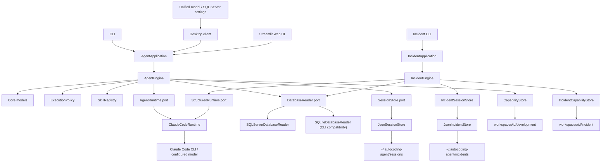
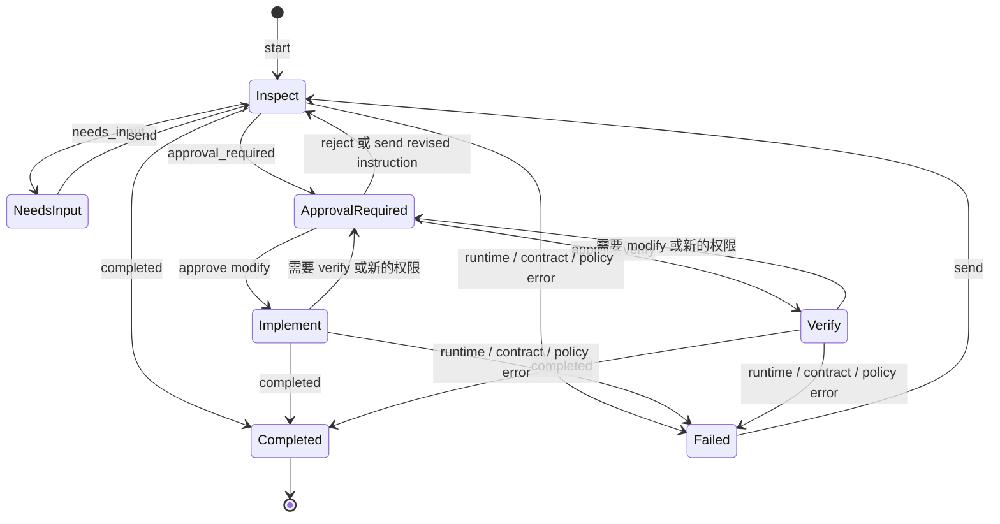
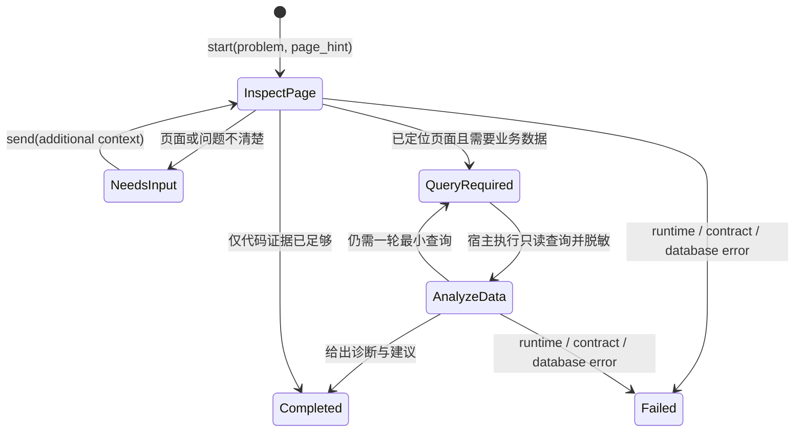

# AutoCoding Engineer 架构说明

本文描述当前 `0.3.2` 代码已经实现的架构。数据字段、公共方法和命令行参数见
[接口与数据契约](INTERFACES.md)。

## 1. 项目目标

AutoCoding Engineer 是一个平台无关的 Agent 内核。当前包含软件开发和异常诊断两个领域；
原生桌面客户端、CLI 和备用 Streamlit 页面只是交互入口，任务理解、代码调查、页面定位、
查询选择和完成判断交给 Claude Code 中的模型；Python 主机负责不能交给模型自行决定的边界：

- 一个任务对应一个可持久化、可恢复的会话；
- 不同执行阶段只开放经过授权的工具；
- 模型输出必须符合固定的结构化契约；
- 工作区路径、结果路径和会话标识经过校验；
- 已完成任务会生成工作区隔离的能力文档，供后续任务参考。
- 两套流程共享同一数据库端口和连接配置；连接始终只读，查询有轮次/行数上限并脱敏敏感列。

当前项目不是工作流平台，也没有 HTTP API、多 Agent 编排、插件市场或后台任务队列。
开发与异常诊断是两个清晰的领域状态机，共享 Claude Code 结构化 Runtime；后续钉钉只是
异常应用门面的新入口，不进入诊断核心。

## 2. 分层结构



| 层 | 目录或模块 | 当前职责 |
| --- | --- | --- |
| 交付接口 | `interfaces/` | 把桌面客户端、CLI、Streamlit 操作转换成统一应用调用 |
| 系统配置 | `model_setup.py`、`sqlserver_service.py`、`workspace_knowledge.py` | 统一管理 Claude Code、模型服务、共用 SQL Server 与分流程 Markdown 知识 |
| 应用门面 | `application.py` | 组装依赖并暴露稳定的任务 API |
| 异常领域 | `incident/` | 页面定位、只读查询计划、数据诊断及独立会话状态机 |
| 核心 | `core/` | 会话状态机、执行模式、数据模型、权限校验 |
| 端口 | `ports/` | 定义模型运行时和会话存储所需的最小协议 |
| 适配器 | `adapters/` | 调用 Claude Code、保存 JSON 会话/能力文档、SQL Server/SQLite 只读访问 |
| Skills | `skills/` | 向模型提供澄清、调查、修改、验证和能力归纳方法 |

`build_application()` 是默认组合根。它创建 `ClaudeCodeRuntime`、`JsonSessionStore`、
`CapabilityStore`、`SkillRegistry`、`ExecutionPolicy` 和 `AgentEngine`，并可注入共用的
`DatabaseReader`，然后返回
`AgentApplication`。接口层不直接依赖 Claude Code 的命令细节。

`build_incident_application()` 是异常流程的组合根。它创建同一个 `ClaudeCodeRuntime`、
独立的 `JsonIncidentStore`，桌面端通过 `SQLServerConnectionService` 注入
`SQLServerDatabaseReader`；原 SQLite 路径继续用于 CLI 兼容。未来接入 MySQL/PostgreSQL
只需实现 `DatabaseReader`；钉钉入口只依赖 `IncidentApplication`。

桌面端只创建一份 `SQLServerConnectionService`。它把同一个只读 reader/reference 注入开发与
异常组合根；连接更换只作用于新任务，已有任务继续绑定启动时的数据源引用，避免半途中切库。

## 3. 核心设计原则

### 3.1 模型做语义判断

模型判断需求是否清楚、应该阅读哪些文件、依赖关系是否相关、问题根因、修改范围和何时
可以如实完成任务。项目没有用文件名关键词或固定打分规则替代这些判断。

Skills 会在每一轮作为系统提示词的一部分显式加载。目前捆绑六种工作方法：

- `clarify_requirement`：需求模糊时每次只问一个高价值问题；
- `investigate_code`：从已有线索开始，读取目标并追踪必要关系；
- `propose_change`：修改前展示当前状态、目标状态、影响、验证计划和合适的预览；
- `implement_change`：只在修改授权后做与任务相关的最小完整变更；
- `verify_change`：只在验证授权后运行主机开放的检查；
- `distill_capability`：完成任务时生成可复用的能力草稿。

这些 Skills 是工作方法，不高于系统权限、当前用户要求和仓库事实。

### 3.2 主机控制副作用

模型不能自行扩大权限。`ExecutionPolicy` 根据本轮已经获批的模式生成 Claude Code 的
`--tools` 和 `--allowedTools`：

| 模式 | 可用能力 |
| --- | --- |
| `inspect` | 只允许 `Read`、`Glob`、`Grep` |
| `implement` | 在只读工具之外允许 `Edit`、`Write` |
| `verify` | 提供 `Bash`，但只预授权代码中列出的测试、静态检查、构建和 Git 只读命令 |

所有模式当前都使用 `dontAsk`。如果模型需要当前模式之外的副作用，它必须返回
`approval_required`，由应用把决定交还给用户，而不是让 Claude Code 临时弹出自己的
权限询问。

Claude Code 以 `--bare` 启动，并使用空 setting sources、严格空 MCP 配置和 `--no-chrome`。
因此目标仓库或用户级 Claude 设置、hooks、插件和 MCP 不能给本轮增加工具或权限。项目的
`CLAUDE.md` 不自动注入；模型只在任务相关时把它当作普通、低优先级项目上下文读取。

核心还会在运行时返回后执行二次校验：

- `inspect` 结果不能报告任何 `changed_files`；
- 新的 `modify` 审批必须携带至少一项非空的结构化修改方案；
- 证据、变更和方案路径不能是绝对路径、Windows drive/root 或包含 `..`；
- 结构化结果中的审批状态和审批对象必须一致。

这些校验是安全边界，不负责判断代码方案是否正确。

## 4. 会话与任务流程

一个 `AgentSession` 表示一个用户任务。它保存用户目标、双方消息、Claude Code 的可恢复
会话 ID、最后决定、待审批请求、使用量和事件。会话由 JSON 文件持久化，因此 CLI 与 UI
可以在不同进程中继续同一任务。



开发 `inspect` 还可进入内部 `query_required`：模型提交至多五条最小参数化 SELECT，主机经
`DatabaseReader` 执行、只把受限结果送回同一 Claude 会话，再继续做语义判断。原始行不写入
开发 session，只持久化查询名、用途、行数、截断和脱敏列审计。`implement/verify` 不允许查库。

状态图表达正常使用路径；结构化契约本身允许模型返回受契约约束的状态。只有
`completed` 在应用层被视为终态，之后 `send()` 会拒绝继续该会话。当前实现允许用户向
`failed` 会话发送新消息重新进入只读调查。

### 4.1 新任务

1. `start()` 严格解析工作区，确认它存在且为目录，并拒绝空消息。
2. 创建会话并立即写入 JSON。
3. 以 `inspect` 模式生成 `RuntimeTurn`。
4. 能力存储准备当前工作区的独立目录；Skill Registry 构造系统提示词。
5. Claude Code 在目标工作区中运行并返回结构化决定。
6. 核心校验决定，追加消息和事件，再次持久化会话。

### 4.2 澄清和恢复

`needs_input` 表示模型暂时不能进行有边界、有价值的调查。用户通过 `send()` 补充一次
消息，核心使用 `inspect` 模式继续。Claude Code 适配器在首轮使用应用会话 UUID 作为
Claude 会话 ID，后续使用返回的 `runtime_session_id` 和 `--resume` 恢复模型上下文。

本地 `messages` 同时完整保存对话记录，供 UI 展示和其他 Runtime 实现使用。当前
Claude Code 适配器依靠 `--resume` 延续模型上下文，没有把 `RuntimeTurn.history` 再次拼入
命令提示词。

### 4.3 审批、修改和验证

模型通过 `ApprovalRequest.scope` 申请两种权限：

- `modify`：模型先在只读轮次读取相关代码，展示结构化方案与适合任务的预览；用户批准后，
  下一轮才以 `implement` 模式执行；
- `verify`：用户批准后，下一轮以 `verify` 模式执行。

修改方案逐项保存文件或区域、当前状态和目标状态，并保存总体目标、影响、验证计划及可选
Markdown 预览。预览形式由模型按任务语义决定，可以是界面线框、接口/数据示例、伪代码或
行为前后对比；无法在实施前可靠预览时必须如实说明，不能伪造结果。

`approve()` 只批准当前待处理请求的范围和已经展示的方案，并把该方案再次传入实施轮次。
旧会话中缺少方案的修改审批可以读取，但不能直接批准，必须先回到只读轮次重新提案。
`reject()` 会把拒绝信息作为新消息，以
`inspect` 模式要求模型给出不使用该权限的真实替代结果。用户在审批等待中直接调用
`send()`，会清除旧审批，并把新消息视为修订后的指令。

修改和验证是分开的权限：`implement` 不能执行命令；`verify` 不能编辑文件。验证发现还
需修改时，模型需要再次申请 `modify`。

### 4.4 失败处理

Claude Code 启动失败、超时、非零退出、无效 JSON、缺少结构化结果、无可恢复 session ID、
Pydantic 契约失败或核心策略违规，都会转换成持久化的 `failed` 决定和 `task_failed`
事件。错误不会以未捕获异常形式丢失当前任务状态。

首轮启动前会把传给 Claude Code 的预分配 UUID 先保存为 runtime session ID。即使模型进程
在建立 transcript 后超时，后续也只会尝试精确 `--resume`，不会把可能已有副作用的轮次
再次当成新会话重放。

应用在调用 Runtime 前已经持久化用户消息和 `turn_started` 事件。当前没有单独的
`running` 状态，也没有后台重试或崩溃恢复队列。

## 5. 异常诊断流程

`IncidentSession` 保存问题、页面线索、来源、外部消息引用、Claude 会话 ID、最后决定和查询
审计摘要。它使用独立的 `~/.autocoding-agent/incidents/`，不会与开发任务会话混用。



模型可用的代码工具固定为 `Read`、`Glob`、`Grep`。它负责从页面线索定位前端页面，并沿最小
相关路径追踪请求、服务和数据访问代码；没有编辑、命令或数据库工具。需要数据时，模型通过
结构化 `DataQuery` 提出最多五条参数化 SQL，由 `IncidentEngine` 交给 `DatabaseReader`。

桌面默认 `SQLServerDatabaseReader` 使用 ODBC 和 `ApplicationIntent=ReadOnly`，只接受单条
`SELECT/WITH`，拒绝分号、注释、写入、DDL、执行、批量和外部数据源等操作；命名参数由宿主
转换为 ODBC 参数绑定，绝不拼接用户值。游标设置查询超时，返回行数取模型请求与主机上限的
较小值。生产数据库账号本身仍应只授予最小读取权限。

SQLite 兼容适配器继续使用 URI `mode=ro`、`PRAGMA query_only` 和 authorizer 三层限制。
两种适配器都把 password、token、secret、authorization、credential 等敏感列替换为
`[REDACTED]`，长文本和二进制会截断或摘要；schema 开头会明确标注 SQL 方言。

SQL Server 非密钥配置原子写入 `<data_dir>/database/sqlserver.json`，密码通过 `keyring`
保存到 Windows Credential Manager。配置状态只公开 `has_password`，UI 密码框不回填。
活动异常会话绑定其创建时的安全数据库引用；用户更换连接后从下一项异常诊断开始使用，避免
历史会话静默切换到另一套业务数据。

查询结果只发送给当前 Claude 会话继续诊断。应用自己的 incident JSON 只保存查询名称、
用途、返回行数、是否截断和脱敏列，不持久化原始业务行。Claude Code 自身的会话 transcript
仍会接收脱敏后的结果，因此生产接入前还应结合企业的数据分级和模型服务策略复核允许字段。

`source` 和 `external_reference` 是为钉钉等外部入口预留的关联字段。当前没有机器人、定时
轮询、数据库写入或自动修复；`automation_candidate` 只是模型对后续自动化价值的结构化判断。

## 6. Claude Code Runtime

`ClaudeCodeRuntime` 是 `AgentRuntime` 和 `StructuredRuntime` 的默认实现。开发流程通过
`run()` 获取 `AgentDecision`；异常流程通过 `run_structured()` 获取 `IncidentDecision`。
适配器不重写模型的 Agent 循环，而是把
以下信息转换为一次 Claude Code CLI 调用：

- 工作目录和用户当前消息；
- 模型名、超时和可选预算；
- 本轮工具集合及预授权集合；
- 所有捆绑 Skill 组成的追加系统提示词；
- 从调用方 Pydantic 模型生成的 JSON Schema；
- 工作区能力目录；
- bare 模式、空 setting sources、严格空 MCP 配置和禁用 Chrome 的隔离参数；
- 新建或恢复 Claude Code 会话所需的 ID。

适配器要求 Claude Code 返回 JSON envelope，且其中包含 `structured_output` 和非空
`session_id`。它将 `structured_output` 校验为调用方要求的模型，并提取 token、费用、耗时和
turn 数量。CLI stderr/stdout 中常见的认证信息会在形成用户可见错误前脱敏。

Windows 子进程同时设置 `CREATE_NO_WINDOW` 和隐藏 `STARTUPINFO`，因此 Claude Code 及其直接
子进程不会在桌面问答时新建控制台窗口。每轮调用通过 `autocoding_agent` logger 记录开始、
结束、会话 ID、模式、耗时、usage、超时或脱敏错误；不会把命令数组、用户消息、系统提示词
或结构化业务结果写入日志。

桌面入口在创建应用组合根之前显示统一的 `SystemSettingsDialog`，其中模型页调用
`ClaudeModelSetupService`。服务只接受真实可执行文件，
用同样的隐藏窗口参数执行 `claude.exe --version`，并把检测结果转换成不包含密钥的
`ModelSetupState`。只有 Claude Code、API 地址、模型名和密钥全部就绪后，客户端才创建
`AgentApplication` 与 `IncidentApplication`。配置保存会清除进程内 Settings 缓存并重建两套
应用门面，因此无需重启客户端；JSON 会话仍位于相同数据目录，不会丢失。

Windows 上的 API Key 只持久化到当前用户的 `HKCU\Environment` 与当前进程环境，不写
`.env`、会话或日志。SQL Server 非密钥字段写入本机数据目录，密码写入 Windows Credential
Manager。配置页只获取两个 `has_*` 布尔值，已有密钥和密码都不会回填到 Tk 输入控件。

## 7. 能力文档生命周期

能力记忆位于 `Settings.data_dir/workspaces/<workspace_id>/`，不会写入目标仓库。其下按领域
分成 `development/` 与 `incident/`；两边各有自己的索引、task JSON 和 Markdown，不会互读。
`pinned/<二级分支>/` 保存用户维护的工作区基础知识，索引每轮重建时都会保留递归链接；自动
完成任务产生的文档仍进入 `capabilities/`。开发与异常处理拥有各自的二级分支树，同名分支也
不会共享文件。`MarkdownKnowledgeService` 校验 Windows 文件名、限定路径范围并执行原子保存。
`workspace_id` 是规范化工作区绝对路径（不区分大小写）计算出的 SHA-256 前 16 位，因此
不同路径的项目默认隔离。


只有 `completed` 会触发 `CapabilityStore.record()`。模型应在最终决定中提供
`CapabilityDraft`；若没有，存储器会根据目标、最终消息、下一步和测试摘要创建保底草稿。

当前落盘结构是：

```text
<data_dir>/
├─ sessions/<session-id>.json
├─ incidents/<session-id>.json
└─ workspaces/<workspace-id>/
   ├─ development/
   │  ├─ CAPABILITIES.md
   │  ├─ pinned/<二级分支>/<workspace-guide>.md
   │  ├─ tasks/<session-id>.json
   │  └─ capabilities/<session-id>.md
   └─ incident/
      ├─ CAPABILITIES.md
      ├─ pinned/<二级分支>/<workspace-guide>.md
      ├─ tasks/<session-id>.json
      └─ capabilities/<session-id>.md
```

开发能力 Markdown 包含适用场景、方法、验证、风险、任务证据和来源任务；异常能力 Markdown
包含页面/代码定位、诊断、发现、查询审计、建议动作和自动化边界。task JSON 保存目标、
结果、变更文件、测试摘要、模型和能力文档相对路径。写入前会替换工作区绝对路径、用户
主目录以及常见 token/password/secret 形式。Markdown 和 JSON 都通过临时文件替换写入。

同一 session 再次记录时，以现有 task JSON 为幂等依据，返回原文档且 `created=false`。
能力保存失败只追加 `capability_failed` 事件，不会把已经完成的软件任务改为失败。

只读轮次通过 Claude Code 的 `--add-dir` 获得当前流程自己的工作区能力目录，并被提示先查看
索引、只读相关条目、以当前代码重新验证。进入 `implement` 或 `verify` 后不再挂载这个工作区
外目录；同一 Claude 会话会保留此前已经读取的上下文。历史能力明确被视为不可信且可能
过期，不能覆盖用户要求或权限边界。

### 当前能力记忆边界

当前实现是“每个完成会话一份能力文档”，尚未实现语义去重、跨任务合并、修订历史、证据
指纹、自动陈旧标记或跨工作区共享。`CAPABILITIES.md` 只是根据 task JSON 重建的 Markdown
索引。第一项任务完成前也会存在一个明确写着暂无能力条目的空索引。

## 8. 持久化和路径边界

会话文件名只能来自合法 UUID；这阻止调用方通过 session ID 构造任意路径。会话和能力
文件均使用同目录临时文件加 replace 的方式写入，避免正常写入中留下半个 JSON 或
Markdown。

目标仓库只在 Claude Code 的当前工作目录中暴露。主机验证结果中的文件路径形式，但当前
不会核实每条相对路径是否真实存在，也没有跨进程文件锁。默认数据目录为
`~/.autocoding-agent`，可通过环境配置更改。

`observability.configure_file_logging()` 在组合应用时创建
`<data_dir>/logs/autocoding-agent.log`。日志采用 2 MB `RotatingFileHandler`，默认保留 5 份；
开发与异常流程共享同一日志文件，便于按 session ID 串联追溯。

## 9. 接口独立性

桌面客户端同时依赖开发 `AgentApplication` 和异常 `IncidentApplication`，通过显式流程
选择器切换，并为每套流程维护独立的当前 session 与历史列表；CLI 与 Web UI 继续使用各自
对应的应用门面。桌面端把同步模型调用放在单一后台线程，所有 Tk 控件仍只由 UI 线程更新；
执行期间禁止重复提交和流程/会话切换。当前 Runtime 没有
取消端口，因此客户端不会提供虚假的停止按钮，任务运行时也会阻止直接关闭窗口。

新的交付媒介可以复用同一门面，无需复制会话、审批或 Runtime 逻辑。模型运行时和会话存储
分别通过 `AgentRuntime`、`SessionStore` Protocol 替换；当前能力存储由 `AgentEngine` 直接
依赖具体的 `CapabilityStore`。

该边界也支持测试时注入假 Runtime：`build_application(settings, runtime=...)` 可替换模型
执行，而保留真实核心与本地存储行为。
