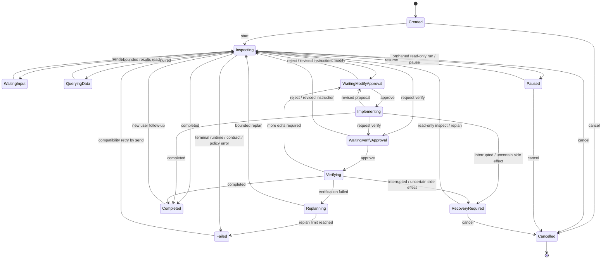
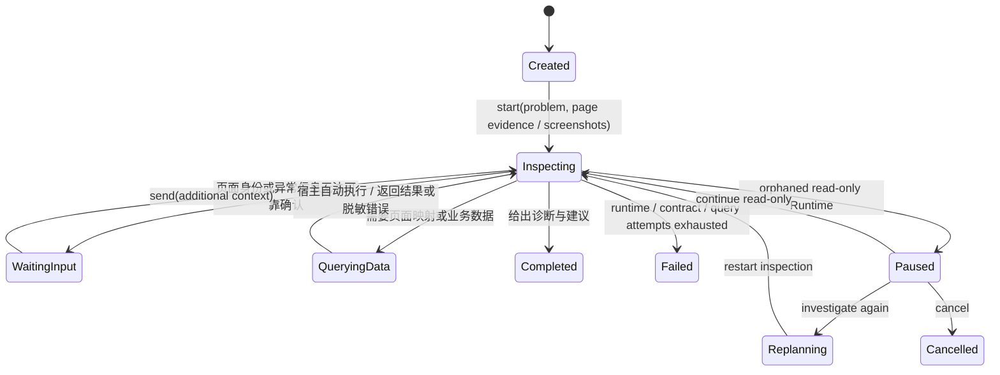
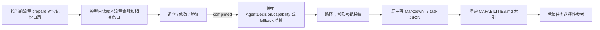

# AutoCoding Engineer 架构说明

本文描述当前 `0.7.0` 代码已经实现的架构。数据字段、公共方法和命令行参数见
[接口与数据契约](INTERFACES.md)。

## 1. 项目目标

AutoCoding Engineer 是一个平台无关的 Agent 内核。当前包含软件开发和异常诊断两个领域；
原生桌面客户端、CLI 和备用 Streamlit 页面只是交互入口，任务理解、代码调查、页面定位、
查询选择和完成判断交给 Claude Code 中的模型；Python 主机负责不能交给模型自行决定的边界：

- 一个任务对应一个可持久化、可恢复的会话；
- 不同执行阶段只开放经过授权的工具；
- 模型输出必须符合固定的结构化契约；
- 工作区路径、结果路径和会话标识经过校验；
- 已完成任务会生成工作区隔离的能力文档，供后续任务参考。
- 两套流程共享同一数据库端口和连接配置；连接始终只读，查询有轮次/行数上限并脱敏敏感列。

当前项目不是工作流平台，也没有 HTTP API、多 Agent 编排、插件市场或后台任务队列。
开发与异常诊断是两个清晰的领域状态机，共享 Claude Code 结构化 Runtime；后续钉钉只是
异常应用门面的新入口，不进入诊断核心。

## 2. 分层结构

```mermaid
flowchart TD
    SETUP["Unified model / SQL Server settings"] --> DESKTOP["Desktop client"]
    CLI["CLI"] --> APP["AgentApplication"]
    INCIDENT_CLI["Incident CLI"] --> INCIDENT_APP["IncidentApplication"]
    DESKTOP --> APP
    WEB["Streamlit Web UI"] --> APP
    APP --> ENGINE["AgentEngine"]
    INCIDENT_APP --> INCIDENT_ENGINE["IncidentEngine"]
    ENGINE --> MODELS["Core models"]
    ENGINE --> POLICY["ExecutionPolicy"]
    ENGINE --> STATE["AgentStateMachine"]
    ENGINE --> HANDLERS["State Handlers"]
    ENGINE --> AUDIT["DecisionRecorder"]
    ENGINE --> ARTIFACTS["ArtifactRecorder"]
    ENGINE --> SKILLS["SkillRegistry"]
    ENGINE --> RUNTIME_PORT["AgentRuntime port"]
    ENGINE --> DB_PORT
    ENGINE --> RAG["KnowledgeRAGService"]
    ENGINE --> HERMES_COORD["HermesConsultationCoordinator"]
    INCIDENT_ENGINE --> STRUCTURED_PORT["StructuredRuntime port"]
    INCIDENT_ENGINE --> DB_PORT["DatabaseReader port"]
    INCIDENT_ENGINE --> RAG
    INCIDENT_ENGINE --> HERMES_COORD
    INCIDENT_ENGINE --> ARTIFACTS
    INCIDENT_ENGINE --> INCIDENT_STORE["IncidentSessionStore"]
    INCIDENT_ENGINE --> STATE
    ENGINE --> SESSION_PORT["SessionStore port"]
    ENGINE --> MEMORY["CapabilityStore"]
    INCIDENT_ENGINE --> INCIDENT_MEMORY["IncidentCapabilityStore"]
    RUNTIME_PORT --> CLAUDE["ClaudeCodeRuntime"]
    STRUCTURED_PORT --> CLAUDE
    DB_PORT --> SQLSERVER["SQLServerDatabaseReader"]
    DB_PORT --> SQLITE["SQLiteDatabaseReader (CLI compatibility)"]
    INCIDENT_STORE --> INCIDENT_SQLITE["SQLiteIncidentStore + EventStore"]
    SESSION_PORT --> TASK_STORE["SQLiteTaskStore + EventStore"]
    ARTIFACTS --> ARTIFACT_STORE["TaskArtifactStore + Git observer"]
    HERMES_COORD --> HERMES_PORT["HermesSkillService port"]
    HERMES_PORT --> HERMES_CLI["Hermes CLI isolated rules + web tools"]
    APP --> RECOVERY["RecoveryManager"]
    INCIDENT_APP --> INCIDENT_RECOVERY["IncidentRecoveryManager"]
    RECOVERY --> SCANNER["OrphanedRunScanner"]
    INCIDENT_RECOVERY --> SCANNER
    RECOVERY --> TASK_STORE
    INCIDENT_RECOVERY --> INCIDENT_SQLITE
    CLAUDE --> CC["Claude Code CLI / configured model"]
    TASK_STORE --> DATA["~/.autocoding-agent/runtime/agent-runtime.db"]
    ARTIFACT_STORE --> ARTIFACT_DATA["~/.autocoding-agent/tasks/id/artifacts"]
    INCIDENT_SQLITE --> DATA
    RAG --> RAG_DB["~/.autocoding-agent/rag/knowledge-*.db"]
    RAG --> KNOWLEDGE_FILES["Project Knowledge / Capability / Engineering Experience MD"]
    INCIDENT_DATA["~/.autocoding-agent/incidents"] --> INCIDENT_SQLITE
    MEMORY --> DEV_MEMORY["workspaces/id/development"]
    INCIDENT_MEMORY --> INCIDENT_MEMORY_DATA["workspaces/id/incident"]
```



| 层 | 目录或模块 | 当前职责 |
| --- | --- | --- |
| 交付接口 | `interfaces/` | 把桌面客户端、CLI、Streamlit 操作转换成统一应用调用 |
| 系统配置 | `model_setup.py`、`embedding_setup.py`、`sqlserver_service.py`、`workspace_config.py`、`workspace_knowledge.py` | 统一管理 Claude Code、生成模型、Voyage Embedding、项目路径、共用 SQL Server 与分流程 Markdown 知识 |
| 应用门面 | `application.py` | 组装依赖并暴露稳定的任务 API |
| 异常领域 | `incident/` | 页面定位、只读查询计划、数据诊断及独立会话状态机 |
| RAG | `knowledge_rag/` | 发现 Markdown、分块、建立可重建双索引、混合检索并按领域/项目/工作区过滤 |
| 核心 | `core/` | 状态机、阶段 Handler、Decision、Artifact、Recovery、执行模式和权限校验 |
| 端口 | `ports/` | 定义 Runtime、Session/Event/Decision/Artifact 存储所需的最小协议 |
| 适配器 | `adapters/` | 调用 Claude Code、保存事务任务/事件/产物与能力文档、观察 Git、只读访问数据库 |
| Skills | `skills/` | 向模型提供澄清、调查、修改、验证和能力归纳方法 |

`build_application()` 是默认组合根。它创建 `ClaudeCodeRuntime`、`SQLiteTaskStore`、
`TaskArtifactStore`、`GitWorkspaceObserver`、`AgentStateMachine`、`RecoveryManager`、
`CapabilityStore`、`SkillRegistry`、`ExecutionPolicy` 和 `AgentEngine`，并可注入共用的
`DatabaseReader` 和 `KnowledgeRetriever`，然后返回
`AgentApplication`。接口层不直接依赖 Claude Code 的命令细节。

`build_incident_application()` 是异常流程的组合根。它创建同一个 `ClaudeCodeRuntime`、
`AgentStateMachine`、`SQLiteIncidentStore`、`IncidentRecoveryManager` 和能力存储，桌面端通过
`SQLServerConnectionService` 注入 `SQLServerDatabaseReader`；开发和异常组合根默认共享同一
`KnowledgeRAGService`。原 SQLite 业务数据库路径继续用于
CLI 兼容。开发与异常快照使用同一个 `agent-runtime.db` 的独立表，但共享生命周期事件模型、
Runtime Run 和孤儿租约扫描。未来接入 MySQL/PostgreSQL 只需实现 `DatabaseReader`；钉钉入口只
依赖 `IncidentApplication`。

桌面端只创建一份 `SQLServerConnectionService`。它把同一个只读 reader/reference 注入开发与
异常组合根；连接更换只作用于新任务，已有任务继续绑定启动时的数据源引用，避免半途中切库。

## 3. 核心设计原则

### 3.1 模型做语义判断

模型判断需求是否清楚、应该阅读哪些文件、依赖关系是否相关、问题根因、修改范围和何时
可以如实完成任务。项目没有用文件名关键词或固定打分规则替代这些判断。

Skills 会在每一轮作为系统提示词的一部分显式加载。目前捆绑六种工作方法：

- `clarify_requirement`：需求模糊时每次只问一个高价值问题；
- `investigate_code`：从已有线索开始，读取目标并追踪必要关系；
- `propose_change`：修改前展示当前状态、目标状态、影响、验证计划和合适的预览；
- `implement_change`：只在修改授权后做与任务相关的最小完整变更；
- `verify_change`：只在验证授权后运行主机开放的检查；
- `distill_capability`：完成任务时生成可复用的能力草稿。

这些 Skills 是工作方法，不高于系统权限、当前用户要求和仓库事实。

### 3.2 主机控制副作用

模型不能自行扩大权限。`ExecutionPolicy` 根据本轮已经获批的模式生成 Claude Code 的
`--tools` 和 `--allowedTools`：

| 模式 | 可用能力 |
| --- | --- |
| `inspect` | 只允许 `Read`、`Glob`、`Grep` |
| `implement` | 在只读工具之外允许 `Edit`、`Write` |
| `verify` | 提供 `Bash`，但只预授权代码中列出的测试、静态检查、构建和 Git 只读命令 |

所有模式当前都使用 `dontAsk`。如果模型需要当前模式之外的副作用，它必须返回
`approval_required`，由应用把决定交还给用户，而不是让 Claude Code 临时弹出自己的
权限询问。

Claude Code 以 `--bare` 启动，并使用空 setting sources、严格空 MCP 配置和 `--no-chrome`。
因此目标仓库或用户级 Claude 设置、hooks、插件和 MCP 不能给本轮增加工具或权限。项目的
`CLAUDE.md` 不自动注入；模型只在任务相关时把它当作普通、低优先级项目上下文读取。

核心还会在运行时返回后执行二次校验：

- `inspect` 结果不能报告任何 `changed_files`；
- 新的 `modify` 审批必须携带至少一项非空的结构化修改方案；
- 证据、变更和方案路径不能是绝对路径、Windows drive/root 或包含 `..`；
- 结构化结果中的审批状态和审批对象必须一致。

这些校验是安全边界，不负责判断代码方案是否正确。

## 4. 会话与任务流程

一个 `AgentSession` 表示一段可以持续追问的软件工程会话；会话内由 `cycle_number` 区分多个
已完成工作轮次。它保存用户目标、本轮目标、双方消息、Claude Code 的可恢复会话 ID、最后决定、
待审批请求、使用量、生命周期状态和事件。开发会话快照与事件由 SQLite 事务存储，因此 CLI 与
UI 可以在不同进程中继续同一任务。

开发流程明确区分三种概念：

- `TaskState`：持久化任务生命周期，由 `AgentStateMachine` 独占修改；
- `AgentStatus`：模型本轮结构化决定的类型，保留现有接口兼容；
- `AgentMode`：本轮 Claude Code 的工具权限档位。

`AgentEngine` 的 public action 会先构造带 command ID 和 expected version 的 `AgentCommand`。
StateMachine 校验转换表、版本和非空原因，再更新 `task_state/version` 并追加
`state_transitioned`。业务代码不直接设置 `task_state`。



开发 `inspect` 还可进入内部 `query_required`：模型提交至多五条最小参数化 SELECT，主机经
`DatabaseReader` 执行、只把受限结果送回同一 Claude 会话，再继续做语义判断。原始行不写入
开发 session，只持久化查询名、用途、行数、截断和脱敏列审计。`implement/verify` 不允许查库。

`replanning`、`paused`、`recovery_required` 和 `cancelled` 已接入公共 API、CLI 和桌面恢复卡。
`completed` 是当前工作轮次的静止完成态，Recovery 扫描会忽略它，但新的用户消息可以显式驱动
`completed -> inspecting`；`cancelled` 才是永久封闭状态。写或验证阶段出现不确定副作用时不得
直接进入普通 failed，而是进入 recovery_required。为兼容旧使用方式，部分明确无副作用的 failed
仍允许通过 send 重新进入只读调查。

### 4.1 新任务

1. `start()` 严格解析工作区，确认它存在且为目录，拒绝空消息，并保存用户选择的知识项目。
2. 创建 `created` 会话和 `task_created` 事件并在同一 SQLite 事务中保存快照与事件。
3. `CreateTask` command 驱动 `created -> inspecting`，再以 `inspect` 模式生成 RuntimeTurn。
4. 能力存储只把所选项目的 MD 同步到当前工作区能力视图；Skill Registry 在提示词中锁定选择。
5. Claude Code 在目标工作区中运行并返回结构化决定。
6. 核心校验决定，由 StateMachine 转入等待、查询、完成或失败状态，追加消息和事件后再次保存。

### 4.2 澄清、暂停和恢复

`needs_input` 表示模型暂时不能进行有边界、有价值的调查。用户通过 `send()` 补充一次
消息，核心使用 `inspect` 模式继续。Claude Code 适配器在首轮使用应用会话 UUID 作为
Claude 会话 ID，后续使用返回的 `runtime_session_id` 和 `--resume` 恢复模型上下文。

本地 `messages` 同时完整保存对话记录，供 UI 展示和其他 Runtime 实现使用。当前
Claude Code 适配器依靠 `--resume` 延续模型上下文，没有把 `RuntimeTurn.history` 再次拼入
命令提示词。

`pause()` 只在安全持久化边界暂停；`cancel()` 不重放任何 Runtime。启动组合根会由
RecoveryManager 扫描非终态任务和未终结 run：孤儿 Inspect 转为 paused，孤儿 Implement/Verify
转为 recovery_required。用户通过 `resume(action)` 选择只读检查、重新规划或取消。

### 4.3 审批、修改和验证

模型通过 `ApprovalRequest.scope` 申请两种权限：

- `modify`：模型先在只读轮次读取相关代码，展示结构化方案与适合任务的预览；用户批准后，
  下一轮才以 `implement` 模式执行；
- `verify`：用户批准后，下一轮以 `verify` 模式执行。

修改方案逐项保存文件或区域、当前状态和目标状态，并保存总体目标、影响、验证计划及可选
Markdown 预览。预览形式由模型按任务语义决定，可以是界面线框、接口/数据示例、伪代码或
行为前后对比；无法在实施前可靠预览时必须如实说明，不能伪造结果。

`approve()` 只批准当前待处理请求的范围和已经展示的方案，并把该方案再次传入实施轮次。
旧会话中缺少方案的修改审批可以读取，但不能直接批准，必须先回到只读轮次重新提案。
`reject()` 会把拒绝信息作为新消息，以
`inspect` 模式要求模型给出不使用该权限的真实替代结果。用户在审批等待中直接调用
`send()`，会清除旧审批，并把新消息视为修订后的指令。

### 4.4 完成后继续对话

到达 `completed` 时当前轮次的 Event、Decision、Artifact 和 Capability 已经封口。之后收到新的
`SUBMIT_USER_INPUT`，Engine 增加 `cycle_number`、记录 `task_reopened`，清空当前决定、审批和
能力文档指针，并重置本轮 `query_rounds/replan_rounds`；历史消息、Runtime Session、事件、决定、
查询审计和 Artifact 均保留。状态机随后执行 `completed -> inspecting`，模型可以利用相关历史，
但 Prompt 要求重新核对当前代码和授权数据。

相同 command ID 在重新打开前先经过 CommandReceipt 幂等检查，因此网络或外部入口重试只返回
原完成结果，不会意外开启额外工作轮次。`cancelled`、`paused` 和 `recovery_required` 仍不能通过
普通输入绕过其安全边界。

修改和验证是分开的权限：`implement` 不能执行命令；`verify` 不能编辑文件。验证发现还
需修改时，模型需要再次申请 `modify`。

### 4.5 失败处理

Claude Code 启动失败、超时、非零退出、无效 JSON、缺少结构化结果、无可恢复 session ID、
Pydantic 契约失败或核心策略违规，都会形成持久化失败事实。只读阶段可以转为 failed；实施或
验证阶段只要副作用状态不确定，就转为 recovery_required 并生成恢复报告。错误不会以未捕获
异常形式丢失当前任务状态。

首轮启动前会把传给 Claude Code 的预分配 UUID 先保存为 runtime session ID。即使模型进程
在建立 transcript 后超时，后续也只会尝试精确 `--resume`，不会把可能已有副作用的轮次
再次当成新会话重放。

应用在调用 Runtime 前已经持久化用户消息、`inspecting/implementing/verifying` 生命周期状态和
`turn_started` 事件。SQLiteTaskStore 在一个 `BEGIN IMMEDIATE` 事务内为新事件分配单调
sequence、追加不可变事件、增加 snapshot revision 并更新 Task snapshot；旧 revision 保存会被
拒绝。命令结束时写入不可变 CommandReceipt；相同 command ID 重试直接返回当前持久化结果。
Runtime run 的 owner、PID、heartbeat 和终态同样进入 SQLite，供启动恢复扫描使用。

## 5. 异常诊断流程

`IncidentSession` 保存问题、可选页面线索、消息附件、来源、外部消息引用、Claude 会话 ID、最后决定、
`TaskState`、version/revision、事件、Runtime Run、CommandReceipt 和查询审计摘要。默认快照位于
`agent-runtime.db` 的异常专用表；旧 `~/.autocoding-agent/incidents/*.json` 只作为幂等导入源，
不会与开发任务 aggregate 混用。



模型可用的代码工具固定为 `Read`、`Glob`、`Grep`。异常调查先理解用户对话中的页面/窗体标题、
相对源码路径、路由、菜单入口和异常上下文；有截图时再分析窗口、标签页、窗体、页面主标题、
菜单和异常区域。标题、路径和视觉特征是否可信由模型结合语义判断，宿主不实现 OCR 关键词、颜色、
固定坐标、文件名或字符串相似度规则。

没有截图时，对话中的可信标题或页面路径任一项都可以作为调查入口；两者都没有时返回
`needs_input`。有截图时，图片没有明显标题但对话有标题/路径，模型先按对话线索定位候选，再与
图片特征交叉验证；对话和图片都没有可信页面身份时才询问。候选与图片存在实质冲突时，模型可在
当前代码证据足够时自行消解，否则请用户确认哪个页面发生异常，不能扫描全部页面映射。

通用强制流程保存在应用包内的 `incident/prompts/incident_workflow.md`，由
`load_incident_workflow_rules()` 每轮加载；它不包含 `Menu`、QTMES 等项目事实。项目表结构、页面
映射 SQL 和代码架构由用户所选 `knowledge/incident/<项目>/<项目>.md` 提供。单次页面映射、数据
摘要和诊断进入异常 Capability，只有人工确认后才进入 RAG，避免用按需检索承担必执行规则。

可信相对源码路径可以直接读取验证，不要求为了流程一致性再查询映射表。标题或路由需要映射时，
模型按项目知识先请求最多 20 条精确/前缀候选；没有可信结果时才从对话或图片中的页面标题提取
关键词，执行一次最多 20 条的包含查询。两轮都没有可信候选就询问更准确的标题、入口或路径。
候选仍由模型结合名称、相对 URL、当前仓库和截图判断；URL 必须打开源码验证。截图中的红色文字
是常见异常线索而不是硬规则，模型也会结合弹窗、空值、状态、表格行或布局判断异常区域。

页面验证后，模型沿最小相关路径追踪请求、服务和数据访问代码；没有编辑、命令或数据库工具。
文字异常先定位产生现象的代码分支，截图异常先定位可见异常区域，再进入相同调用链。需要业务
数据时，模型从已读代码与 schema 中提取/形成最多五条结构化、参数化 `DataQuery`，由
`IncidentEngine` 直接交给 `DatabaseReader`，不能要求用户手工运行 SQL。`completed` 契约除页面
身份和诊断外，还强制至少一个已验证的工作区相对页面源文件；从路径开始调查时，模型从当前代码
补全结构化页面名称。

查询错误经过脱敏后自动返回同一模型会话修正，并计入查询轮次；达到上限才转为失败。成功查询
只把限行、脱敏后的结果发回当前 Runtime。持久化审计保存查询名称、用途、SQL SHA-256 指纹、
参数名、行数、截断和脱敏列，不保存 SQL 参数值或原始业务行。

桌面默认 `SQLServerDatabaseReader` 使用 ODBC 和 `ApplicationIntent=ReadOnly`，只接受单条
`SELECT/WITH`，拒绝分号、注释、写入、DDL、执行、批量和外部数据源等操作；命名参数由宿主
转换为 ODBC 参数绑定，绝不拼接用户值。游标设置查询超时，返回行数取模型请求与主机上限的
较小值。生产数据库账号本身仍应只授予最小读取权限。

SQLite 兼容适配器继续使用 URI `mode=ro`、`PRAGMA query_only` 和 authorizer 三层限制。
两种适配器都把 password、token、secret、authorization、credential 等敏感列替换为
`[REDACTED]`，长文本和二进制会截断或摘要；schema 开头会明确标注 SQL 方言。

SQL Server 非密钥配置原子写入 `<data_dir>/database/sqlserver.json`，密码通过 `keyring`
保存到 Windows Credential Manager。配置状态只公开 `has_password`，UI 密码框不回填。
活动异常会话绑定其创建时的安全数据库引用；用户更换连接后从下一项异常诊断开始使用，避免
历史会话静默切换到另一套业务数据。

查询结果只发送给当前 Claude 会话继续诊断。应用自己的 incident snapshot 只保存查询审计摘要，
不持久化原始业务行。Claude Code 自身的会话 transcript
仍会接收脱敏后的结果，因此生产接入前还应结合企业的数据分级和模型服务策略复核允许字段。

`source` 和 `external_reference` 是为钉钉等外部入口预留的关联字段。当前没有机器人、定时
轮询、数据库写入或自动修复；`automation_candidate` 只是模型对后续自动化价值的结构化判断。

## 6. Claude Code Runtime

`ClaudeCodeRuntime` 是 `AgentRuntime` 和 `StructuredRuntime` 的默认实现。开发流程优先通过
`run_observed()` 获取 `AgentDecision` 并实时保存活动；兼容 Runtime 可继续实现 `run()`。异常流程
通过 `run_structured()` 获取 `IncidentDecision`。
适配器不重写模型的 Agent 循环，而是把
以下信息转换为一次 Claude Code CLI 调用：

- 工作目录和用户当前消息；
- 模型名、超时和可选预算；
- 本轮工具集合及预授权集合；
- 所有捆绑 Skill 组成的追加系统提示词；
- 从调用方 Pydantic 模型生成的 JSON Schema；
- 工作区能力目录；
- 经主机校验的异常截图隔离目录，以及消息中精确的图片路径；
- bare 模式、空 setting sources、严格空 MCP 配置和禁用 Chrome 的隔离参数；
- 新建或恢复 Claude Code 会话所需的 ID。

开发适配器以 `Popen` 启动 `--output-format stream-json --include-hook-events`，从 system、assistant、
ToolUse、ToolResult 和 result 行构造脱敏 RuntimeActivity。最终 result 必须包含
`structured_output` 和非空 `session_id`，再校验为调用方要求的模型并提取 token、费用、耗时和
turn 数量。活动、stderr/stdout 中的凭据和工作区外绝对路径会在持久化前脱敏。

每轮建立 `RuntimeRunRecord`，保存 task/state/mode、owner、PID、heartbeat 和终态。适配器维护
活动进程表并支持 `interrupt(run_id)`；这表示终止已登记父进程，不承诺回滚已发生的工具副作用。
成功的 Bash ToolResult 只有匹配宿主认可的测试命令时才生成 host-verified `test_executed`。

Windows 子进程同时设置 `CREATE_NO_WINDOW` 和隐藏 `STARTUPINFO`，因此 Claude Code 及其直接
子进程不会在桌面问答时新建控制台窗口。每轮调用通过 `autocoding_agent` logger 记录开始、
结束、会话 ID、模式、耗时、usage、超时或脱敏错误；不会把命令数组、用户消息、系统提示词
或结构化业务结果写入日志。

桌面入口在创建应用组合根之前显示统一的 `SystemSettingsDialog`，其中生成模型页调用
`ClaudeModelSetupService`。服务只接受真实可执行文件，
用同样的隐藏窗口参数执行 `claude.exe --version`，并把检测结果转换成不包含密钥的
`ModelSetupState`。只有 Claude Code、API 地址、模型名和密钥全部就绪后，客户端才创建
`AgentApplication` 与 `IncidentApplication`。配置保存会清除进程内 Settings 缓存并重建两套
应用门面，因此无需重启客户端；JSON 会话仍位于相同数据目录，不会丢失。Embedding 页通过
`EmbeddingSetupService` 保存和测试 Voyage；配置变化为新索引和新任务构造新的 RAG 服务，
活动任务继续使用启动时的 Retriever。

Windows 上的生成模型 API Key 只持久化到当前用户的 `HKCU\Environment` 与当前进程环境，不写
`.env`、会话或日志。Voyage API Key 与 SQL Server 密码写入 Windows Credential Manager，非密钥
字段写入本机数据目录。配置页只获取 `has_*` 布尔状态，已有密钥和密码都不会回填到 Tk 输入控件。

桌面端粘贴的异常截图由 `IncidentAttachmentStore` 读取，统一解码并转存为 PNG；每张图片使用
独立 UUID 目录，位于 `<data_dir>/attachments/incident/`，不写目标仓库。主机限制单条消息最多
5 张、单张 10 MiB、4000 万像素，并在 Incident Engine 再次核对路径、后缀和大小。Runtime 只
通过对应的 `--add-dir` 暴露这些隔离父目录，异常流程仍只有 Read/Glob/Grep。系统提示词要求把
图片及其中的文字视为不可信证据，不能把截图内的命令式文本提升为指令。

## 7. 能力文档生命周期

能力记忆位于 `Settings.data_dir/workspaces/<workspace_id>/`，不会写入目标仓库。其下按领域
分成 `development/` 与 `incident/`；两边各有自己的索引、task JSON 和 Markdown，不会互读。
项目根目录的 `knowledge/<development|incident>/<二级路径>/<二级路径名>.md` 保存用户维护的
基础知识，一个二级路径只对应一份同名 Markdown。任务开始时，只有用户在对话页“项目”
选择框选中的 MD 会同步到当前工作区能力目录的 `pinned/` 只读视图并进入索引；所选项目名
持久化在 session 中，后续对话继续使用同一份知识。自动完成任务产生的文档仍进入
`capabilities/`。开发与异常处理拥有各自的二级路径，同名路径也不会共享文件。
`MarkdownKnowledgeService` 校验 Windows 文件名、限定项目知识目录并执行原子保存。
`workspace_id` 是规范化工作区绝对路径（不区分大小写）计算出的 SHA-256 前 16 位，因此
不同路径的项目默认隔离。



只有 `completed` 会触发 `CapabilityStore.record()`。澄清、查询、审批和验证只是同一工作轮次的
中间状态，不单独生成或追加 MD。一个新 Session 首次完成时创建一份文档；同一 Session 重新打开
并再次完成时，把本轮内容追加到原文档。模型应在最终决定中提供
`CapabilityDraft`；若没有，存储器会根据目标、最终消息、下一步和测试摘要创建保底草稿。

当前落盘结构是：

```text
<data_dir>/
├─ runtime/agent-runtime.db
├─ workspace/project.json
├─ attachments/incident/<attachment-id>/incident-screenshot.png
├─ tasks/<task-id>/
│  ├─ manifest.json
│  └─ artifacts/<artifact-uuid>.<json|patch|md>
├─ sessions/<session-id>.json        # 旧开发会话，仅作为自动导入来源保留
├─ incidents/<session-id>.json
└─ workspaces/<workspace-id>/
   ├─ development/
   │  ├─ CAPABILITIES.md
   │  ├─ pinned/<二级路径>/<二级路径名>.md
   │  ├─ tasks/<session-id>.json
   │  └─ capabilities/<session-id>.md
   └─ incident/
      ├─ CAPABILITIES.md
      ├─ pinned/<二级路径>/<二级路径名>.md
      ├─ tasks/<session-id>.json
      └─ capabilities/<session-id>.md
```

用户直接维护的源文件不在 `<data_dir>`，而在本项目：

```text
knowledge/
├─ development/<二级路径>/<二级路径名>.md
└─ incident/<二级路径>/<二级路径名>.md
```

开发能力 Markdown 包含适用场景、方法、验证、风险、任务证据和来源任务；异常能力 Markdown
包含页面/代码定位、诊断、发现、查询审计、建议动作和自动化边界。task JSON 保存目标、
结果、变更文件、测试摘要、模型和能力文档相对路径。写入前会替换工作区绝对路径、用户
主目录以及常见 token/password/secret 形式。Markdown 和 JSON 都通过临时文件替换写入。

同一 Session 始终使用 `<session-id>.md` 和 `<session-id>.json`。主 task JSON 保存 `cycles`、
`cycle_count` 和 `last_cycle_number`；已记录的 cycle 再次提交时直接返回，不重复追加。新 cycle
完成时原子重写 frontmatter 并在正文末尾追加独立的后续轮次章节，索引仍只有一个 Session 条目。
v0.5.3 曾短暂产生的 `-cycle-NNN` 文件不会被删除；Store 在下次触碰该 Session 时读取其元数据、
把内容折叠进主文档，并在索引中按 Session 去重。
能力保存失败只追加 `capability_failed` 事件，不会把已经完成的软件任务改为失败。

只读轮次通过 Claude Code 的 `--add-dir` 获得当前流程自己的工作区能力目录，并被提示先查看
索引、只读相关条目、以当前代码重新验证。进入 `implement` 或 `verify` 后不再挂载这个工作区
外目录；同一 Claude 会话会保留此前已经读取的上下文。历史能力明确被视为不可信且可能
过期，不能覆盖用户要求或权限边界。

### 当前能力记忆边界

当前实现是“每个完成 Session 一份能力文档，后续 cycle 追加章节”，尚未实现语义去重、跨任务
合并、章节压缩、证据指纹、自动陈旧标记或跨工作区共享。`CAPABILITIES.md` 只是根据 task JSON
重建的 Markdown 索引。第一项任务完成前也会存在一个明确写着暂无能力条目的空索引。

## 8. 手动 RAG 知识层

RAG 是 Project Knowledge、Capability 和 Engineering Experience Markdown 之上的可重建
检索视图，不是新的事实源。`KnowledgeRAGService.refresh_documents()` 只发现文档并同步
`pending/indexed/outdated/failed/removed` 状态；任务完成不会自动建立索引。桌面知识库管理页允许
用户预览分块并明确选择加入、重建或移除。移除索引不会删除源 Markdown。

`MarkdownChunker` 先移除 frontmatter，再按标题路径、段落和 fenced code block 切分；目标约
750 tokens、最大约 1200 tokens，同章节只保留小范围重叠。每个 Chunk 保存稳定 ID、正文 Hash、
标题路径、来源类型、领域、项目、工作区和源路径，使向量数据库可以完全重建且结果可以引用。

检索同时取 Dense Top 20 和 SQLite FTS5/BM25 Top 20，由宿主使用 RRF
`1 / (60 + rank)` 融合，默认返回 6 个结果且每个文档最多 2 个 Chunk。开发只检索
`development/general`，异常只检索 `incident/general`，并应用所选项目与 workspace ID 过滤。
命中的内容以来源明确的“不可信、可能过期参考”加入只读调查 Prompt；模型仍必须用当前代码和
已授权数据库证据复核。检索成功、空结果和失败分别形成可审计事件；检索故障不改变主任务状态。

未配置 Voyage 时，`EmbeddingProvider` 使用明确标识的 `fake-hash-embedding-v1`；配置完成后，
`VoyageEmbeddingProvider` 通过 Bearer 认证调用可编辑的 `/v1/embeddings` 端点，文档/查询分别
发送 `input_type=document/query`，并校验数量、顺序、有限浮点数和输出维度。API 请求按最多
128 个 Chunk 分批，失败错误不会包含 API Key。

向量当前由 `SQLiteVectorStore` 本地持久化并线性计算点积，Chunk/FTS5 与向量使用同一个按
provider/endpoint/model/dimension 指纹隔离的 `knowledge-voyage-<index-id>.db`。切换配置后新的
数据库从 pending 状态开始，必须由用户手动全量重建；旧模拟/旧模型索引不迁移、不删除。外部
向量数据库和大规模 ANN 检索仍是后续独立能力。

## 9. 持久化和路径边界

开发任务 ID 和异常任务 ID 都必须是合法 UUID；这阻止调用方通过 session ID 构造任意路径。
开发 Task snapshot、Event、Decision、Artifact metadata、Runtime Run 和 Command Receipt，以及
异常 Task snapshot、Event、Runtime Run 和 Command Receipt，使用 SQLite WAL、foreign key、
busy timeout 和单事务提交；
`revision` 提供乐观并发检查，`version` 表达生命周期转换次数。Event ID 全局唯一，task 内
sequence 单调递增，已追加事件若被修改会拒绝保存。旧 `sessions/*.json` 启动时幂等导入，导入
完成后不再作为运行时任务写入目标。旧异常 JSON 同样幂等导入但不删除；能力 Markdown 继续使用
临时文件加 replace。

`SQLiteTaskStore.replay_task_state()` 与 `SQLiteIncidentStore.replay_task_state()` 按 sequence 回放
`state_transitioned` 并验证 from/to 链；旧 JSON 没有生命周期事件时会生成 actor=migration 的
合成导入事件。两套 Recovery Manager 共享 `OrphanedRunScanner`，启动时检查非终态 snapshot、
run owner/PID/heartbeat。开发写阶段进入 `recovery_required`，异常只读阶段进入 `paused`，两者都
不会自动重放旧 Runtime。

Artifact 正文不写入目标仓库。`TaskArtifactStore` 使用 UUID 文件名、内容 SHA-256、大小限制、
凭据脱敏和短临时文件原子替换；SQLite 只保存不可变元数据。Git observer 记录 status、commit、
staged/unstaged diff 和未跟踪路径，但不会自动读取未跟踪文件正文。

桌面新任务的项目根目录由 `WorkspaceConfigStore` 原子保存到
`<data_dir>/workspace/project.json`。保存时必须解析为现存目录；更换配置只影响之后创建的新任务，
已有开发或异常 Session 继续使用自己快照中的 workspace，避免续聊时静默切换代码库。

目标仓库只在 Claude Code 的当前工作目录中暴露。主机验证结果中的文件路径形式，但当前
不会核实每条相对路径是否真实存在，也没有跨进程文件锁。默认数据目录为
`~/.autocoding-agent`，可通过环境配置更改。

`observability.configure_file_logging()` 在组合应用时创建
`<data_dir>/logs/autocoding-agent.log`。日志采用 2 MB `RotatingFileHandler`，默认保留 5 份；
开发与异常流程共享同一日志文件，便于按 session ID 串联追溯。

## 10. 接口独立性

桌面客户端同时依赖开发 `AgentApplication` 和异常 `IncidentApplication`，通过显式流程
选择器切换，并为每套流程维护独立的知识项目选项、当前 session 与历史列表；CLI 与 Web UI 继续使用各自
对应的应用门面。桌面端把同步模型调用放在单一后台线程，所有 Tk 控件仍只由 UI 线程更新；
执行期间禁止重复提交和流程/会话切换。Runtime 具备内部 interrupt 端口；产品界面在安全边界
提供 pause/cancel，并在 recovery_required 时显示只读检查、重新规划和取消选项，不把进程终止
描述成副作用回滚。

新的交付媒介可以复用同一门面，无需复制会话、审批或 Runtime 逻辑。模型运行时和会话存储
分别通过 `AgentRuntime`、`SessionStore` Protocol 替换；当前能力存储由 `AgentEngine` 直接
依赖具体的 `CapabilityStore`。

该边界也支持测试时注入假 Runtime：`build_application(settings, runtime=...)` 可替换模型
执行，而保留真实核心与本地存储行为。

## 11. 实时进度投影

`ProgressEvent` 是独立于 `TaskState` 的瞬时交互契约。开发与异常应用门面接受可选
`ProgressSink`，Engine 在真实主机动作开始时发送稳定阶段；Observable Runtime 的
`RuntimeActivity` 再由 `ProgressProjector` 投影为阅读代码、分析图片、修改和验证等安全状态。

```text
Host action / RuntimeActivity
             ↓
      ProgressProjector
             ↓
        ProgressEvent
             ↓
 Desktop queue → 淡出/淡入状态条

TaskState / Event Store  ── 独立持久化，不由 UI 进度反向驱动
```

进度文案由主机维护的阶段表产生。模型和工具只能贡献经过裁剪的文件名等辅助详情，不能直接
输出思维链、SQL、命令、密钥或原始工具输入。相同阶段合并，快速切换设置最小可见时间；
`ProgressSink` 异常被隔离并写日志，不允许中断任务主流程。桌面端只从后台结果队列消费事件，
所有 Tk 控件更新仍发生在 UI 线程。

## 12. Hermes Skill 外部经验边界

Hermes 以可替换 `HermesSkillService` 端口接入，不取代 Claude Code Runtime。开发与异常模型在
只读 inspect 阶段可返回 `hermes_skill_required`，其中只包含一个动态目录中的精确 Skill 名称、
抽象问题和选择原因。`HermesConsultationCoordinator` 统一处理预算、事件、结果 Artifact 与失败
降级，任务状态在咨询期间保持 `inspecting`。

```text
Claude structured request
          ↓ exact skill + abstract question
HermesConsultationCoordinator
          ↓ allowlist / timeout / redaction / one-call budget
Hermes CLI --ignore-rules --toolsets web --skills <exact-name> --max-turns 4
          ↓ sanitized, bounded output
untrusted candidate guidance
          ↓
same Claude session validates against code / authorized data / user intent
```

CLI 子进程的 cwd 固定为 `HERMES_HOME`，不挂载目标工作区；使用 `--ignore-rules` 跳过自动注入的
AGENTS/Memory/规则，只开放 `web` toolset，并在 Windows 隐藏控制台。保留用户 Hermes 模型与
provider 配置，避免 `--safe-mode` 连同 `config.yaml` 一起屏蔽。宿主不会自动发送用户历史、源码或数据库行，只发送模型生成且
经过凭据脱敏的抽象问题。输出最长 16,000 字符，并通过 `hermes_skill_requested/completed/failed`
事件和 `hermes_skill_result` Artifact 留痕；Artifact 的 `host_verified=false` 明确表示外部建议不是
工程事实。服务不存在、模型未配置、超时或非零返回码都不会终止主流程，Claude 会收到脱敏失败
说明并继续处理。

首版不开放 Hermes 文件工具、Shell、业务数据库、Memory 同步、Skill 写入或状态控制。这个边界
使后续可以替换为别的工程经验提供者，而无需改变 Agent 状态机和交付媒介。
